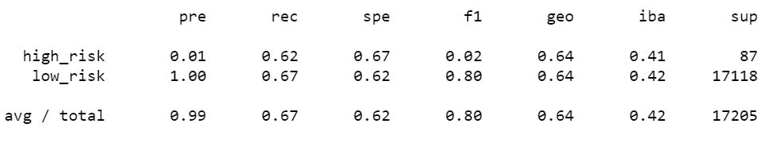
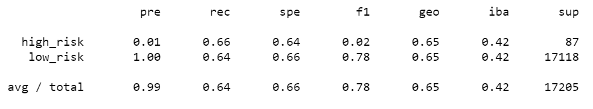
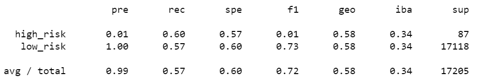
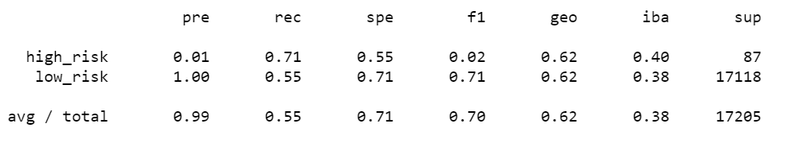
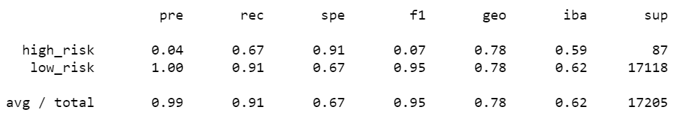
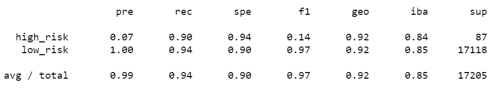

# Credit_Risk_Analysis

## Overview of the analysis
Credit risk is an inherently unbalanced classification problem, as good loans easily outnumber risky loans. Therefore, I will need to employ different techniques to train and evaluate models with unbalanced classes. I am asked to use imbalanced-learn and scikit-learn libraries to build and evaluate models using resampling.

Using the credit card credit dataset from LendingClub, a peer-to-peer lending services company, I will split the data into training and validation sets and:
  - oversample the data using RandomOverSampler and SMOTE algorithms
  - undersample the data using the ClusterCentroids algorithm
  - combinatorial approach of over- and undersampling using the SMOTEENN algorithm

Next, I  will compare two new machine learning models that reduce bias:
  - BalancedRandomForestClassifier
  - EasyEnsembleClassifier
  
I will evaluate the performance of these models.

## Results

### RandomOverSampler (Logistic Regression)

The accuracy is 64.42%.

confusion matrix is:

[  54,    33]

[5689, 11429]

### SMOTE (Logistic Regression)

The accuracy is 64.83%.

confusion matrix is:

[   57,    30]

[ 6139, 10979]

### ClusterCentroids (Logistic Regression)

The accuracy is 58.51%.

confusion matrix is:

[  52,   35]

[7318, 9800]

### SMOTEENN (Logistic Regression)

The accuracy is 62.99%.

confusion matrix is:

[  62,   25]

[7751, 9367]

### BalancedRandomForestClassifier

The accuracy is 78.78%.

The confusion matrix is:

[   58,    29]

[ 1560, 15558]

### EasyEnsembleClassifier

The accuracy is 91.98%.

The confusion matrix is:

[   78,     9]

[  975, 16143]
       
## Summary

Among the four logistic regression, oversample methods(RandomOverSampler and SMOTE) return highest accuracy. The results of these two are close (64.4% vs 64.8%).

Among two machine learning algorithms, EasyEnsembleClassifier gives better accuracy(92%).

Overall, machine learning algorithms give much higher accurac. In this type of problem,  EasyEnsembleClassifier is recommended.

